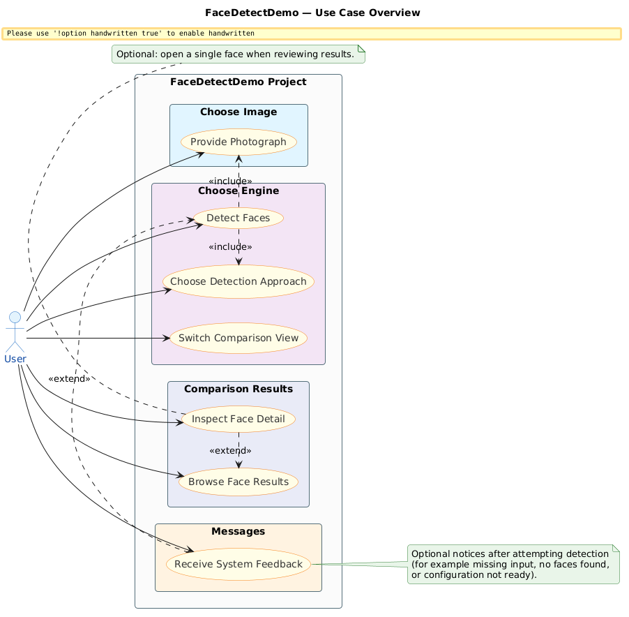

# FaceDetectDemo

## 1. Overview

FaceDetectDemo lets you supply a photo from the camera or library, then run face detection with **either** Apple’s **Vision** framework or Google’s **ML Kit Face Detection**, and browse cropped faces plus metadata in a split UI so you can compare the two engines on the same image.

The app follows **MVC** with clear boundaries between UIKit controllers, presentation helpers, and detector “services” (`VisionFaceDetecter`, `MLKitFaceDetecter`). **SOLID** shows up mainly as protocol-oriented seams (`VisionFaceDetecting`, `MLKitFaceDetecting`, `StoryboardInstantiable`, `Alertable`) and small, focused types for models and layout. **Clean Architecture** is applied lightly: domain-ish structs (`VisionFace`, `MLKitFace`, outputs) sit beside detectors instead of a full multi-layer graph—intentionally, to keep the sample small and runnable while still isolating Apple vs Google APIs.

## 2. Use case overview

The diagram below summarizes **user goals** for FaceDetectDemo at an overview level (not UI widgets or class names). Editable source: [`Diagrams/Usecase/usecase.puml`](./Diagrams/Usecase/usecase.puml).



How this README and diagram are maintained: [`readme_instruction.md`](./readme_instruction.md) · PlantUML / PNG workflow: [`Diagrams/Usecase/usecase_instruction.md`](./Diagrams/Usecase/usecase_instruction.md).

## 3. Architecture

At a high level, a single **root** `ViewController` owns shared chrome (image preview, model picker, detect action) and **embeds** child controllers in a container: `VisionViewController` or `MLKitViewController` depending on a segmented control. Detection runs asynchronously (`async`/`await`); results reload collection views in the active module. Vision uses `VNDetectFaceLandmarksRequest`; ML Kit uses `FaceDetector` via **GoogleMLKit/FaceDetection**.

## 4. Key Design Decisions

- **Decision 1: Parallel detectors with shared input —** Both pipelines accept `UIImage`, normalize orientation, return cropped face images plus structured landmarks/metadata (`VisionModel.swift`, `MLKitModel.swift`). **Why:** Side-by-side comparison on identical input. **Trade-off:** Duplicated cropping/orientation logic and two SDKs to maintain; gains clarity for benchmarking behavior, not a single production abstraction.

- **Decision 2: User interaction and presentation —** Storyboard-driven UI with type-safe instantiation via `StoryboardInstantiable` (storyboard name = class name, single `instantiateViewController` entry point). The root controller **embeds** Vision and ML Kit flows using `UIViewController.addChild(_:to:)` / `removeChild` from `UIViewController+Extensions.swift`, so each engine keeps its own storyboard and collection layout without duplicating the shell. `UIView+Extensions.swift` supports layout helpers (`visibility`, `addSubviews`, `removeAllSubViews`) for adaptive chrome. **CardSubtileEffect** is an `@IBDesignable` card with shadow, corner radius, and **press scale/release** animations for tactile-feeling tiles. **Alertable** centralizes `UIAlertController` presentation for validation and errors. **Haptics:** `UINotificationFeedbackGenerator` (with `view:` on iOS 17.5+) pairs with `animateView` when the user tries to detect before choosing a model—visual shake plus a warning notification feedback.


## 5. Setup

1. **Requirements:** macOS with Xcode, [CocoaPods](https://cocoapods.org/), and an iOS device(MLKit 3rd and Camera permissions apply on device).

2. **Install dependencies** from the `FaceDetectDemo` directory:

   ```bash
   cd FaceDetectDemo
   pod install
   ```

3. **Open the workspace** (not the `.xcodeproj` alone when using CocoaPods):

   ```bash
   open FaceDetectDemo.xcworkspace
   ```

4. **Build & run** the `FaceDetectDemo` scheme on your target; grant camera and photo library access when prompted.

